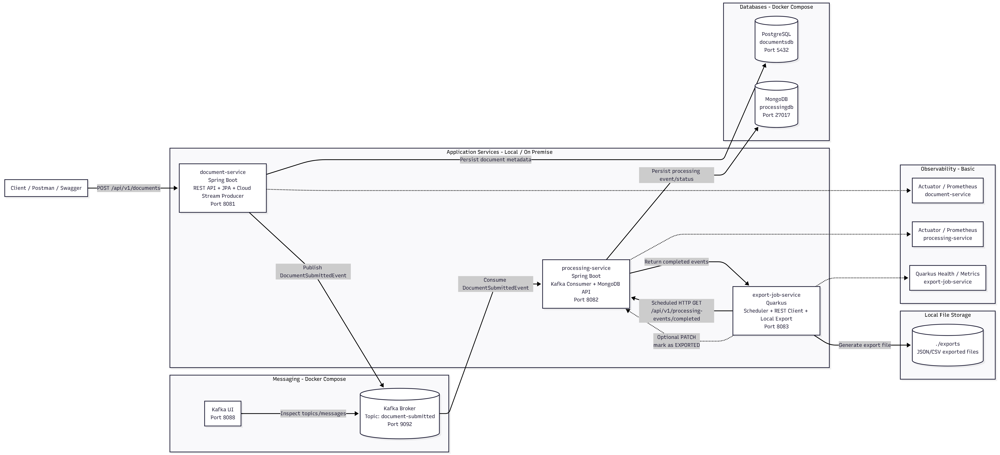
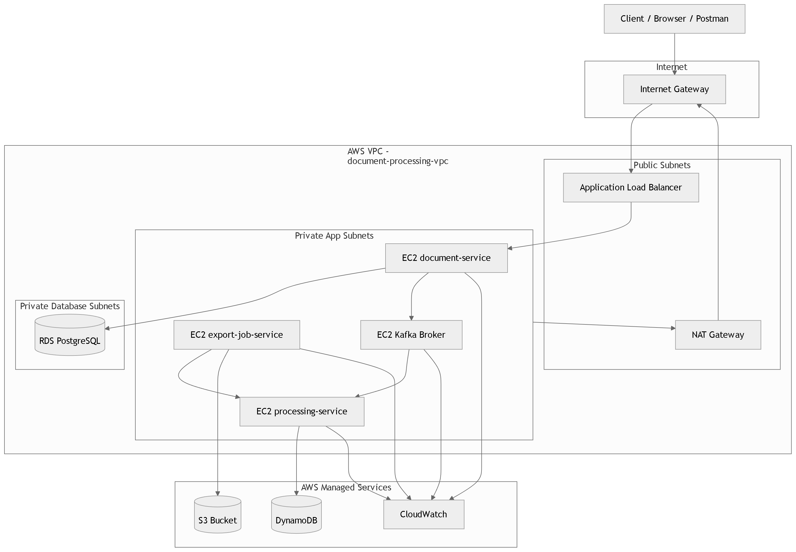

# Document Processing Architecture Lab

<div align="center">


</div>

---

## Visão geral

O **Document Processing Architecture Lab** é um laboratório de arquitetura backend criado para consolidar, de ponta a ponta, conceitos de **microsserviços**, **mensageria assíncrona**, **persistência poliglota**, **observabilidade**, **containerização**, **infraestrutura como código** e **evolução para cloud na AWS**.

A regra de negócio é propositalmente simples: um documento é cadastrado, um evento é publicado em um tópico Kafka, outro serviço processa esse evento e persiste o histórico de processamento, e um job periódico exporta os registros concluídos.

O foco do projeto não é complexidade de domínio. O foco é demonstrar capacidade de desenhar, implementar, observar e evoluir uma arquitetura distribuída com tecnologias utilizadas em cenários reais de backend e cloud.

---

## Objetivos arquiteturais

Este projeto foi construído para praticar e demonstrar:

- Arquitetura de microsserviços com responsabilidades separadas.
- Comunicação síncrona via HTTP e assíncrona via Apache Kafka.
- Uso de banco relacional e NoSQL no mesmo ecossistema.
- Processamento orientado a eventos com Spring Cloud Stream.
- Job agendado com Quarkus Scheduler.
- Exportação de dados para armazenamento local e posterior evolução para S3.
- Observabilidade com logs estruturados, métricas customizadas e tracing distribuído.
- Containerização com Docker e Docker Compose.
- Evolução arquitetural de ambiente local/on-premise para AWS.
- Provisionamento de infraestrutura com Terraform.
- Separação entre arquitetura local e arquitetura cloud.

---

## Arquitetura local / on-premise

A primeira versão do projeto executa todos os componentes localmente, com Docker Compose e serviços containerizados.



### Componentes locais

| Componente | Tecnologia | Responsabilidade |
|---|---|---|
| `document-service` | Spring Boot + PostgreSQL + Spring Cloud Stream | API principal para cadastro de documentos e publicação de eventos |
| `processing-service` | Spring Boot + MongoDB + Kafka Consumer | Consumo de eventos e persistência do histórico de processamento |
| `export-job-service` | Quarkus + Scheduler + REST Client | Job periódico que consulta eventos concluídos e exporta arquivos |
| Kafka | Apache Kafka | Broker de mensageria assíncrona |
| PostgreSQL | PostgreSQL | Banco relacional do serviço de documentos |
| MongoDB | MongoDB | Banco NoSQL do serviço de processamento |
| Prometheus | Prometheus | Coleta de métricas |
| Grafana | Grafana | Dashboards de métricas |
| Jaeger | Jaeger | Visualização de traces distribuídos |

---

## Arquitetura cloud / AWS

A evolução para cloud foi desenhada com uma arquitetura mais próxima de um cenário real de implantação em AWS, mantendo a proposta hands-on e didática.



### Componentes AWS planejados/provisionados

| Camada | Serviço AWS | Finalidade |
|---|---|---|
| Rede | VPC | Isolamento da infraestrutura |
| Rede | Public Subnets | Camada pública para ALB e Bastion |
| Rede | Private App Subnets | Camada privada para EC2s de aplicação e Kafka |
| Rede | Private DB Subnets | Camada privada para RDS |
| Entrada | Application Load Balancer | Exposição controlada do `document-service` |
| Compute | EC2 | Execução dos serviços e Kafka em modelo IaaS |
| Banco relacional | RDS PostgreSQL | Substituição do PostgreSQL local |
| NoSQL | DynamoDB | Substituição planejada do MongoDB |
| Storage | S3 | Substituição do armazenamento local de exports |
| IaC | Terraform | Provisionamento versionado da infraestrutura |
| Observabilidade | CloudWatch | Evolução natural para logs e métricas na AWS |

---

## Fluxo funcional

### 1. Cadastro do documento

O cliente envia uma requisição para o `document-service`.

```http
POST /api/v1/documents
```

O serviço:

1. Valida a requisição.
2. Persiste os metadados do documento no PostgreSQL.
3. Publica um evento `DocumentSubmittedEvent` no Kafka.
4. Retorna a resposta para o cliente.

### 2. Processamento assíncrono

O `processing-service` consome o evento publicado no tópico Kafka.

O serviço:

1. Recebe o evento `DocumentSubmittedEvent`.
2. Cria um registro de processamento.
3. Persiste o evento no MongoDB.
4. Atualiza o status para `COMPLETED`.
5. Expõe endpoints para consulta dos processamentos.

### 3. Exportação periódica

O `export-job-service`, implementado com Quarkus, executa um job agendado.

O serviço:

1. Chama o `processing-service` via HTTP.
2. Busca eventos com status `COMPLETED`.
3. Gera um arquivo JSON.
4. Salva localmente no ambiente on-premise.
5. Na evolução cloud, salva o arquivo em um bucket S3.

---

## Serviços

### `document-service`

Serviço principal da aplicação.

**Responsabilidades:**

- Expor API REST para cadastro e consulta de documentos.
- Persistir documentos no PostgreSQL.
- Publicar eventos no Kafka com Spring Cloud Stream.
- Expor health checks e métricas via Spring Boot Actuator.
- Gerar logs estruturados com `correlationId`, `documentId`, `traceId` e `spanId`.

**Tecnologias principais:**

- Java 21
- Spring Boot
- Spring Web
- Spring Data JPA
- PostgreSQL
- Spring Cloud Stream
- Kafka Binder
- Actuator
- Micrometer
- OpenTelemetry

### `processing-service`

Serviço responsável pelo processamento assíncrono dos eventos.

**Responsabilidades:**

- Consumir eventos do Kafka.
- Persistir histórico de processamento no MongoDB.
- Expor endpoints para consulta de eventos processados.
- Preparar evolução para DynamoDB em ambiente AWS.
- Expor métricas customizadas de consumo e processamento.
- Participar do fluxo de observabilidade distribuída.

**Tecnologias principais:**

- Java 21
- Spring Boot
- Spring Data MongoDB
- Spring Cloud Stream
- Apache Kafka
- MongoDB
- Micrometer
- OpenTelemetry
- DynamoDB SDK, na evolução cloud

### `export-job-service`

Serviço responsável pela exportação periódica dos registros processados.

**Responsabilidades:**

- Executar job agendado.
- Consultar o `processing-service`.
- Gerar arquivo JSON de exportação.
- Salvar localmente no ambiente on-premise.
- Evoluir para salvar em S3 no ambiente AWS.
- Aplicar resiliência básica em chamadas HTTP.
- Expor health checks, métricas e tracing.

**Tecnologias principais:**

- Java 21
- Quarkus
- Quarkus Scheduler
- MicroProfile REST Client
- SmallRye Fault Tolerance
- Micrometer
- OpenTelemetry
- Amazon S3 SDK, na evolução cloud

---

## Estratégia de observabilidade

A observabilidade foi pensada em três pilares: **logs**, **métricas** e **tracing**.

### Logs estruturados

Os serviços registram eventos importantes do fluxo, como:

- Criação de documento.
- Persistência no PostgreSQL.
- Publicação de evento no Kafka.
- Consumo de evento.
- Persistência no MongoDB.
- Execução do job de exportação.
- Geração de arquivo.
- Falhas e exceções relevantes.

Campos relevantes usados nos logs:

- `correlationId`
- `traceId`
- `spanId`
- `documentId`
- `processingEventId`
- `jobName`
- `status`
- `recordsCount`
- `durationMs`

### Métricas customizadas

Além das métricas técnicas expostas por Actuator/Micrometer, o projeto adiciona métricas de negócio e fluxo.

Exemplos:

```text
documents_created_total
document_events_published_total
document_events_consumed_total
document_processing_completed_total
document_processing_failed_total
export_job_runs_total
export_job_success_total
export_job_failed_total
export_records_exported_total
```

Essas métricas permitem acompanhar o comportamento real do sistema, não apenas métricas de JVM ou HTTP.

### Tracing distribuído

O tracing permite visualizar a jornada de uma requisição ou execução entre os serviços.

Exemplos de spans esperados:

```text
document.create
document.process
processing-events.export
```

Ferramentas utilizadas:

- OpenTelemetry
- Micrometer Tracing
- Jaeger

---

## Stack de infraestrutura local

O ambiente local utiliza Docker Compose para subir a infraestrutura de apoio.

Componentes previstos:

- PostgreSQL
- MongoDB
- Kafka
- Kafka UI
- Prometheus
- Grafana
- Jaeger

---

## Executando localmente

### Pré-requisitos

- Java 21
- Maven
- Docker
- Docker Compose
- Git

### 1. Clonar o repositório

```bash
git clone https://github.com/felipematheus1337/document-processing-architecture-lab.git
cd document-processing-architecture-lab
```

### 2. Gerar os pacotes dos serviços

```bash
cd document-service
mvn clean package -DskipTests

cd ../processing-service
mvn clean package -DskipTests

cd ../export-job-service
mvn clean package -DskipTests
```

### 3. Subir infraestrutura local

```bash
docker compose up -d --build
```

### 4. Testar criação de documento

```bash
curl -X POST http://localhost:8081/api/v1/documents \
  -H "Content-Type: application/json" \
  -H "X-Correlation-Id: test-local-001" \
  -d '{
    "title": "Documento de Arquitetura",
    "description": "Documento criado para validar o fluxo completo",
    "ownerName": "Felipe",
    "fileName": "documento-arquitetura.pdf"
  }'
```

### 5. Consultar processamentos

```bash
curl http://localhost:8082/api/v1/processing-events
curl http://localhost:8082/api/v1/processing-events/completed
```

### 6. Executar exportação manual

```bash
curl -X POST http://localhost:8083/api/v1/exports/run
```

---

## URLs locais

| Ferramenta | URL |
|---|---|
| `document-service` | `http://localhost:8081` |
| `processing-service` | `http://localhost:8082` |
| `export-job-service` | `http://localhost:8083` |
| Kafka UI | `http://localhost:8088` |
| Prometheus | `http://localhost:9090` |
| Grafana | `http://localhost:3000` |
| Jaeger | `http://localhost:16686` |

---

## Health checks e métricas

### Spring Boot services

```text
GET /actuator/health
GET /actuator/prometheus
```

### Quarkus service

```text
GET /q/health
GET /q/metrics
```

---

## Terraform e infraestrutura AWS

A infraestrutura AWS foi organizada em arquivos Terraform para separar responsabilidades.

Estrutura sugerida:

```text
terraform/
  provider.tf
  variables.tf
  terraform.tfvars
  network.tf
  security-groups.tf
  database.tf
  storage.tf
  dynamodb.tf
  compute.tf
  alb.tf
  outputs.tf
```

### Recursos provisionados

- VPC
- Internet Gateway
- NAT Gateway
- Public Subnets
- Private App Subnets
- Private DB Subnets
- Route Tables
- Security Groups
- RDS PostgreSQL
- S3 Bucket
- DynamoDB Table
- EC2 Bastion
- EC2 document-service
- EC2 processing-service
- EC2 export-job-service
- EC2 Kafka
- Application Load Balancer
- Target Group
- Listener HTTP

---

## Executando Terraform

> Atenção: alguns recursos geram custo, especialmente NAT Gateway, RDS e EC2. Para laboratório, destrua a infraestrutura ao final dos testes.

```bash
cd terraform
terraform init
terraform fmt
terraform validate
terraform plan
terraform apply
```

Para remover tudo:

```bash
terraform destroy
```

---

## Evolução local para cloud

| Responsabilidade | Ambiente local | Ambiente AWS |
|---|---|---|
| API principal | Spring Boot em container/local | EC2 atrás de ALB |
| Banco relacional | PostgreSQL local | RDS PostgreSQL |
| Mensageria | Kafka local via Docker | Kafka em EC2 |
| Processamento NoSQL | MongoDB local | DynamoDB |
| Exportação | Arquivo local | S3 |
| Observabilidade | Prometheus, Grafana, Jaeger | CloudWatch e possível stack observability dedicada |
| Infraestrutura | Docker Compose | Terraform + AWS |

---

## Decisões arquiteturais

### Separação entre serviço transacional e serviço de processamento

O `document-service` é responsável pelos dados transacionais do documento. O `processing-service` é responsável pelo histórico e estado de processamento. Essa separação reduz acoplamento e torna o fluxo mais próximo de arquiteturas orientadas a eventos.

### Uso de Kafka

Kafka foi utilizado para praticar comunicação assíncrona, desacoplamento entre serviços e processamento orientado a eventos.

### Persistência poliglota

O projeto utiliza PostgreSQL para dados transacionais e MongoDB para eventos de processamento. Na evolução cloud, o MongoDB é substituído conceitualmente por DynamoDB, reforçando o aprendizado de modelagem NoSQL gerenciada na AWS.

### Quarkus para o job de exportação

O `export-job-service` foi implementado em Quarkus para praticar uma stack diferente do Spring Boot, usando scheduler, REST Client, health checks, métricas e fault tolerance.

### Storage local evoluindo para S3

A exportação foi inicialmente implementada com filesystem local. A evolução para S3 foi planejada por meio de abstração de storage, permitindo alternar entre ambiente local e cloud.

### Infraestrutura como código

Terraform foi utilizado para criar a infraestrutura AWS de maneira versionada, reproduzível e documentada, evitando criação manual desorganizada via console.

---

## Próximas melhorias possíveis

- Automatizar deploy com GitHub Actions.
- Publicar imagens no Amazon ECR.
- Migrar execução das EC2s para ECS.
- Substituir Kafka em EC2 por Amazon MSK ou por SNS/SQS em uma versão AWS-native.
- Adicionar CloudWatch Logs Agent.
- Criar dashboards no CloudWatch ou Grafana provisionado.
- Adicionar alertas para falhas de processamento e exportação.
- Refinar IAM com least privilege.
- Adicionar testes de integração com Testcontainers.
- Adicionar LocalStack para simular S3/DynamoDB localmente.
- Criar módulo Terraform reutilizável por camada.

---

## Status do projeto

Este projeto conclui um ciclo prático de arquitetura backend/cloud:

- Ambiente local funcional.
- Microsserviços comunicando via Kafka.
- Persistência relacional e NoSQL.
- Job assíncrono de exportação.
- Observabilidade com logs, métricas e tracing.
- Containerização.
- Imagens publicáveis em registry.
- Infraestrutura AWS modelada com Terraform.
- Evolução arquitetural documentada para RDS, DynamoDB, S3, EC2 e ALB.

---

## Autor

Desenvolvido por **Felipe Matheus** como laboratório prático de arquitetura de software, microsserviços, observabilidade, containerização, infraestrutura como código e cloud computing com AWS.
